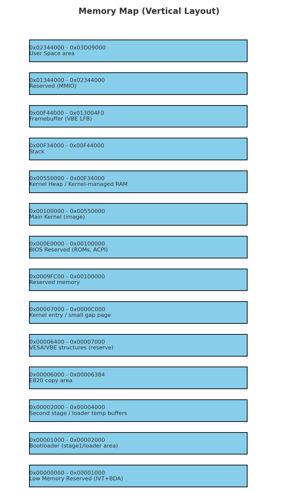
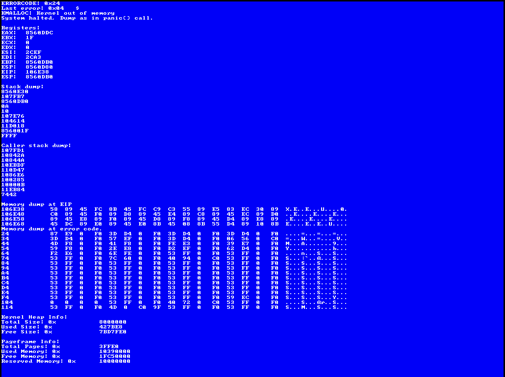

# atOS — a 32-bit Operating System


⚠️ **atOS is in early development**  

A custom 32-bit operating system written in **C** and **Assembly**.  
Boots from an ISO image and runs as a raw binary.  
Intentionally built without modern security constraints to encourage deep low-level learning, experimentation, and hacking.

---

## Preview





---

## Table of Contents

- [Overview](#overview)
- [Features](#features)
- [Running atOS](#running-atos)
- [Development](#development)
  - [Dependencies](#dependencies)
  - [Building](#building)
  - [Debugging](#debugging)
- [Project Roadmap](#project-roadmap)
- [Documentation](#documentation)
- [License](#license)

---

## Overview

atOS is a **from-scratch 32-bit x86 operating system** crafted in C and Assembly.  
The project is geared toward systems programmers, students, and OS enthusiasts who want to explore how operating systems work at the hardware/software boundary.  

Unlike modern operating systems, atOS removes safety restrictions, giving developers complete control and transparency into memory, hardware, and execution.

---

## Features

- 🖥️ **32-bit x86 Architecture** — runs on legacy and virtualized hardware.  
- 🛠️ **Custom Language Support** — an integrated experimental language for writing OS-level applications.  
- 🔓 **No Safety Barriers** — no protection layers or user/kernel enforcement, making it ideal for exploration and teaching.  
- 📖 **Open Source** — licensed under MIT, free to use, modify, and extend.  

---

## Running atOS

You can run atOS from the provided ISO in a virtual machine.  
QEMU is the recommended environment, others aren't guaranteed to work.

### System Requirements

| Resource | Recommended | Minimum |
| -------- | ----------- | ------- |
| RAM      | 256 MB      | 64 MB   |
| CPU      | 1 Core      | 1 Core  |
| HDD      | 256 MB      | 128 MB  |

### Install QEMU (Debian/Ubuntu)

```bash
sudo apt install qemu-system-x86
````

### Install QEMU (Windows)

Download from the [official QEMU website](https://www.qemu.org/download/#windows) and follow the installation instructions, or use [WSL](https://learn.microsoft.com/en-us/windows/wsl/install) with the Linux instructions above.

### Booting atOS with QEMU

```bash
qemu-img create -f raw hdd.img 256M
qemu-system-i386 \
  -boot d \
  -vga std \
  -cdrom atOS.iso \
  -drive file=hdd.img,format=raw,if=ide,index=0,media=disk \
  -m 512
```

---

## Development

Want to dig into the source or contribute? Here’s how to set up the environment.

### Dependencies

Install the essential build tools:

```bash
sudo apt install qemu-system-x86 nasm make gcc genisoimage
```

| Tool            | Purpose                      |
| --------------- | ---------------------------- |
| qemu-system-x86 | Run and debug the OS         |
| nasm            | Assemble low-level code      |
| make            | Automate builds              |
| gcc             | Utility compilation          |
| genisoimage     | Generate bootable ISO images |

### Building

The project uses `make` with simple targets:

* **Show all available commands:**

  ```bash
  make help
  ```

* **Build and launch atOS:**

  ```bash
  make iso run
  ```

### Debugging

Debugging support is minimal.
Please see DOCS/DEBUGGING.md for current options and tips.

---

## Project Roadmap

Planned and in-progress features for atOS:

* [x] Bootloader and raw binary kernel loading
* [x] Basic memory management (paging, allocator, frame bitmap)
* [X] ISO9660 support
* [X] Basic drivers (keyboard, screen, disk I/O)
* [ ] FAT32 filesystem support
* [ ] System call interface
* [ ] Multitasking and scheduling
* [ ] Shell environment for interacting with the system
* [ ] Userland application support via custom language

*This roadmap is tentative and may evolve as the project grows.*

---

## Documentation

Additional documentation is located in the `DOCS/` folder, as well as inline within source directories and headers.

---

## License

This project is licensed under the **MIT License**.
See the [LICENSE](LICENSE) file for details.

```

---
